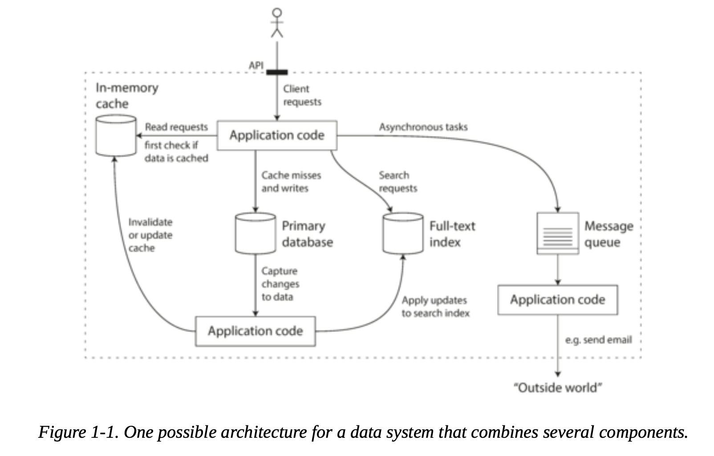
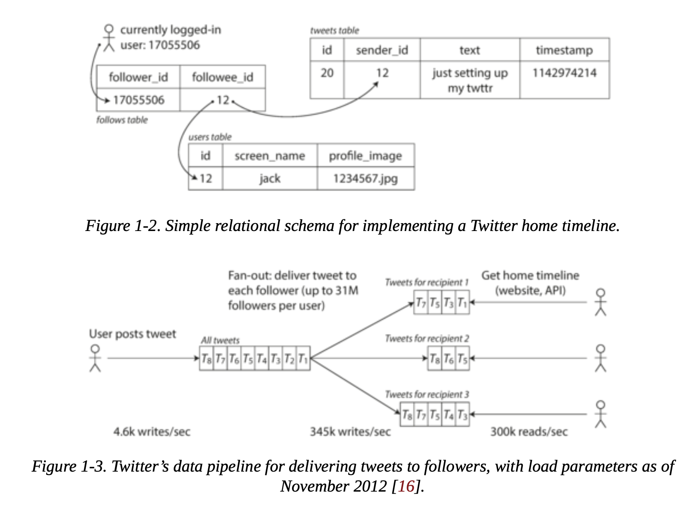
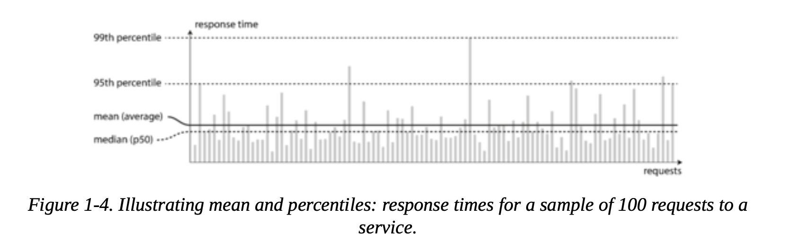

# Ch 1 - Reliable, Scalable, and Maintainable Applications

Apps today are **data-intensive**, not compute-intensive. It's not about CPU anymore. It's about how much data you have, how messy it is, and how fast it changes.

Same building blocks everywhere: **databases, caches, search indexes, stream processing, batch processing**. You just gotta pick the right ones and wire them up.

---

## Why "Data Systems"?

The lines are blurring. Redis is a datastore but people use it as a message queue. Kafka is a queue but it has DB-like durability. Most apps today mash together a bunch of tools behind one API. Congrats, you're a **data system designer** now.

Three things matter: **Reliability, Scalability, Maintainability**.



---

## Reliability

> "Keep working correctly, even when stuff goes wrong."

- **Fault** = one component goes off-script
- **Failure** = the whole system dies for the user
- The goal isn't preventing every fault. It's stopping faults from turning into failures.

Netflix's **Chaos Monkey** kills random processes on purpose. If your fault handling can't survive that, it won't survive production either.

### Hardware faults
- 10,000 disks? Expect one to die every single day.
- Old school fix: throw redundancy at it. RAID, dual power supplies, hot-swap CPUs.
- New school: **software fault-tolerance**. Design assuming machines will just vanish (because in the cloud, they do).
- Nice side effect: you get **rolling upgrades** for free. Zero downtime patches.

### Software faults
- Way scarier than hardware because they're **correlated**. One bug can take down every node at once.
- The 2012 leap second bug crashed a huge chunk of the internet simultaneously.
- Runaway processes gobbling up all your memory. Cascading failures where one domino tips over everything.
- There's no magic fix. Test hard, isolate processes, monitor everything, and sanity-check your own assumptions.

### Human errors
- Surprise: humans cause most outages. Config mistakes, not hardware, are the #1 killer (hardware is only 10-25%).
- Make the right thing easy to do, the wrong thing hard.
- Give people sandboxes with real data so they can experiment safely.
- Make rollbacks fast. Roll out changes gradually. Watch your dashboards.

---

## Scalability

You can't just say "this system is scalable." That's meaningless. The real question: *"when load grows like THIS, what do we do?"*

### Describing load

Figure out the right **load parameters** for your system. Requests per second? Read/write ratio? Concurrent users? Cache hit rate? Depends on what you're building.

### Twitter example

This one's great. Back in 2012:
- Posting tweets: 4.6k/sec average, 12k peak
- Reading home timelines: 300k/sec
- The killer? **Fan-out.**



**Approach 1** - query at read time. Brutal at 300k/sec.
```sql
SELECT tweets.*, users.*
FROM tweets
  JOIN users ON tweets.sender_id = users.id
  JOIN follows ON follows.followee_id = users.id
WHERE follows.follower_id = current_user
```

**Approach 2** - pre-compute every user's timeline. When someone tweets, shove it into all their followers' caches. Cool, until someone with 30 million followers tweets. That's 30 million writes. From one tweet.

**Approach 3 (what they actually do)** - hybrid. Regular people get fan-out on write. Celebrities get pulled in at read time and mixed in. Best of both worlds.

### Describing performance

- **Batch systems** (like Hadoop): you care about **throughput**. How many records per second?
- **Online systems**: you care about **response time**. How long does the user wait?
- Latency and response time aren't the same thing. Latency is just the waiting-in-line part. Response time is everything - service time, network, queuing, all of it.

### Use percentiles, not averages

Averages lie. One super-fast request and one super-slow one average out to "fine." Nobody experienced "fine."

- **p50** (median) tells you the typical experience
- **p95, p99, p999** tell you how bad things get for the unlucky ones
- Amazon noticed their slowest requests came from their best customers. Makes sense - more purchases means more data to load.
- 100ms slower = 1% less sales. That's real money.
- **Tail latency amplification** is nasty. If one user request hits five backend services, you only need ONE slow service to ruin the whole experience.



### Coping with load

- **Scale up** = bigger machine. **Scale out** = more machines. Usually you need a mix.
- Auto-scaling sounds cool but manual scaling is simpler and less surprising.
- Distributing stateless stuff is easy. **Stateful data is where it gets painful.**
- There's no universal scaling architecture. It depends entirely on YOUR load pattern.
- If you're early stage: **ship fast**. Don't engineer for traffic you don't have yet.


---

## Maintainability

Here's the thing nobody likes hearing: most software cost comes from **keeping it running**, not building it.

### Operability
Make your ops team's life easier. Good monitoring, easy automation, no snowflake servers, decent docs, sane defaults, predictable behavior. Boring stuff that matters a ton.

### Simplicity
Complexity is a slow killer. State space explodes, modules get tangled, one hack leads to another, and suddenly nobody understands the system.
- Fight it with **abstraction**. Clean interfaces that hide the mess underneath.
- Kill **accidental complexity** - the stuff that isn't about the actual problem, just your implementation choices.

### Evolvability
Requirements will change. That's not a risk, it's a certainty. TDD and refactoring help at the code level. At the system level, it comes back to simplicity and good abstractions. If the system is easy to understand, it's easy to change.

---

## TL;DR

- **Reliability** - keep working when things break. Hardware fails randomly, software fails systematically, humans fail inevitably.
- **Scalability** - know your load, measure with percentiles, add capacity with intention.
- **Maintainability** - good abstractions, good ops tooling, design for the change that's definitely coming.

No silver bullets. But the same patterns keep popping up everywhere. That's what the rest of this book digs into.
